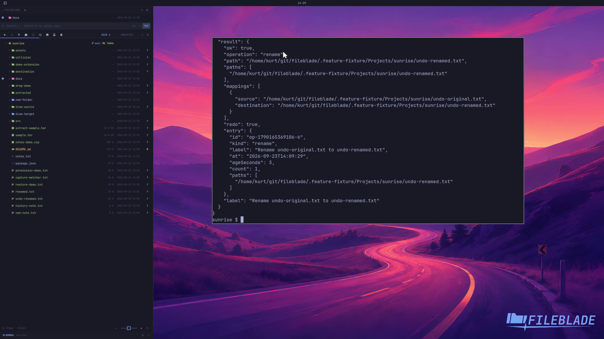

This file was written by an agent.

# Undo and redo file operations

Undo reverses an eligible completed operation; redo reapplies it. Inspect operation history when you need the recorded result.

```sh
fileblade undo --wait
fileblade redo --wait
```

Demonstration: A sample rename is undone and then reapplied without losing the file contents.

Evidence reviewed.



[Watch the focused demonstration](undo-redo.mp4) (5.87 seconds; muted, original speed).

Capture source: `8e07a7eb93ddac81af15a9d35eaf21d6171833ae`. See the [evidence standard](../evidence.md) and [coverage](../catalog.json).
