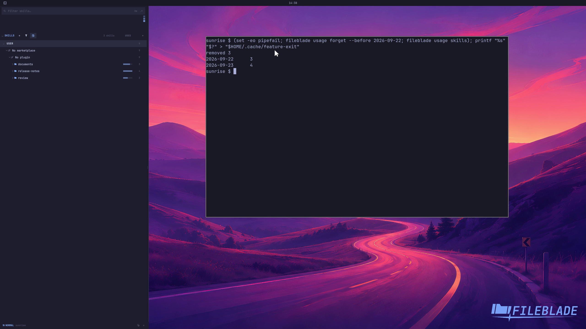

This file was written by an agent.

# Forget stored agent usage

Forget stored usage events before a chosen local date, or clear the usage history. This changes FileBlade's usage database, not the original agent transcripts.

```sh
fileblade usage forget --before 2026-09-22
```

Demonstration: Events before the chosen cutoff disappear while later sample events remain.

The recording uses disposable synthetic activity; forgetting real usage is a deliberate data-removal action.

Evidence reviewed.



[Watch the focused demonstration](retention.mp4) (5.97 seconds; muted, original speed).

Capture source: `3db27943d1b3a31e155febf9cf0928fb7bb6eb63`. See the [evidence standard](../../evidence.md) and [coverage](../../catalog.json).
