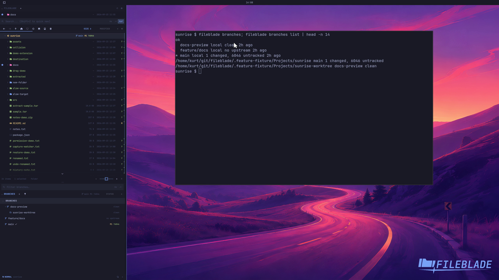

This file was written by an agent.

# Inspect Git branches

Open Branches for the current repository to inspect branch names and linked worktrees.

```sh
fileblade branches
fileblade branches list
```

Demonstration: The pane and CLI list the sample repository's actual local branches.

Evidence reviewed.



[Watch the focused demonstration](branches.mp4) (5.87 seconds; muted, original speed).

Capture source: `8e07a7eb93ddac81af15a9d35eaf21d6171833ae`. See the [evidence standard](../../evidence.md) and [coverage](../../catalog.json).
