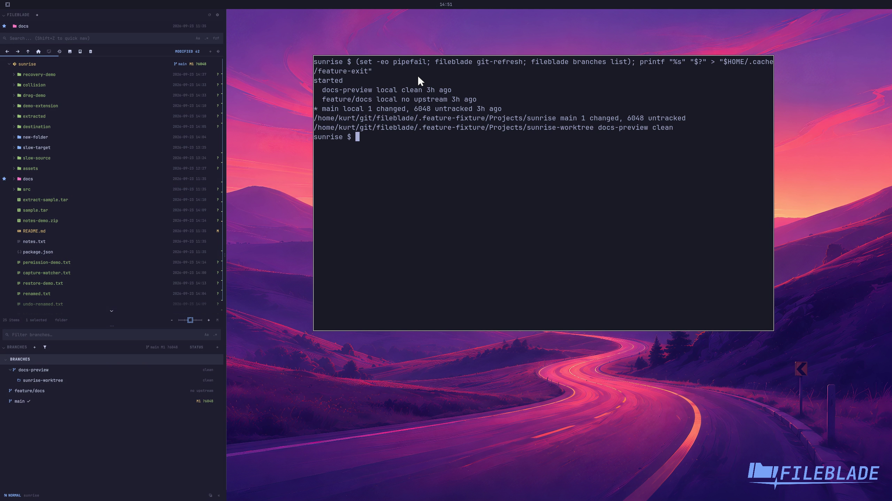

This file was written by an agent.

# Inspect worktree status

Branch and worktree summaries expose the checkout's current Git state. Refresh after external changes when necessary.

```sh
fileblade git-refresh
fileblade branches list
```

Demonstration: The branch listing reports the sample checkout's current change information.

Evidence reviewed.



[Watch the focused demonstration](status.mp4) (5.97 seconds; muted, original speed).

Capture source: `c3e48bbee4f8e6c5adf0e12a3b1781ed6f6af833`. See the [evidence standard](../../evidence.md) and [coverage](../../catalog.json).
