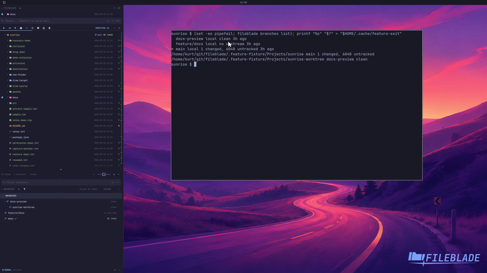

This file was written by an agent.

# Discover linked worktrees

Branches identifies worktrees linked to the repository. Their paths distinguish checkouts that may have different branches or changes.

```sh
fileblade branches list
```

Demonstration: The linked docs-preview worktree appears with its actual path.

This clip proves worktree discovery, not opening that checkout in an application.

Evidence reviewed.



[Watch the focused demonstration](worktrees.mp4) (5.97 seconds; muted, original speed).

Capture source: `c3e48bbee4f8e6c5adf0e12a3b1781ed6f6af833`. See the [evidence standard](../../evidence.md) and [coverage](../../catalog.json).
