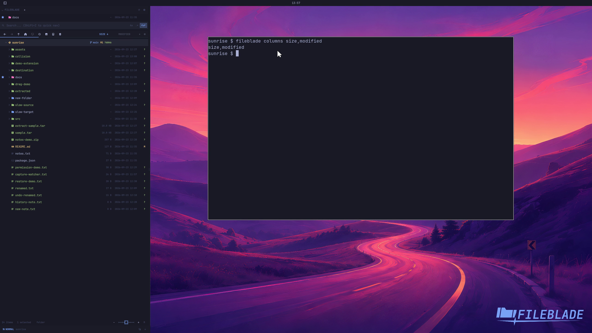

This file was written by an agent.

# Choose file columns

Choose which metadata columns appear beside file names. The CLI accepts a comma-separated list.

```sh
fileblade columns size,modified
```

Demonstration: Size and Modified columns appear with actual file metadata.

Evidence reviewed.



[Watch the focused demonstration](columns.mp4) (5.83 seconds; muted, original speed).

Capture source: `8e07a7eb93ddac81af15a9d35eaf21d6171833ae`. See the [evidence standard](../../evidence.md) and [coverage](../../catalog.json).
