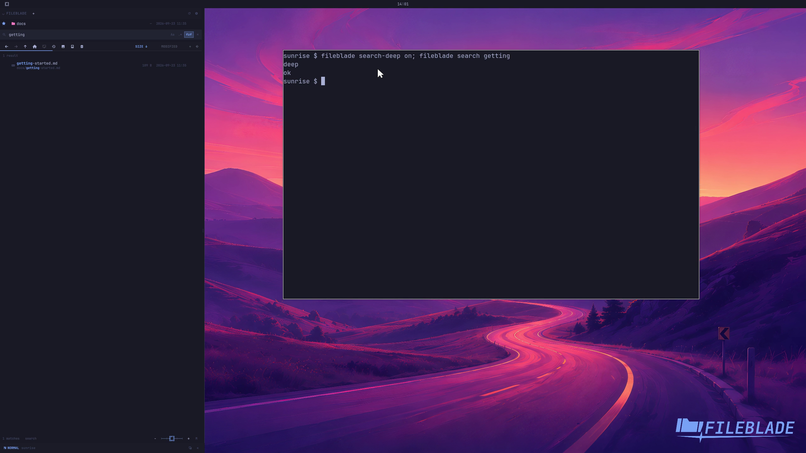

This file was written by an agent.

# Search nested folders

Enable deep search to find entries below the current folder, including inside collapsed directories.

```sh
fileblade search-deep on
fileblade search getting
```

Demonstration: A nested getting-started document appears with its location.

Evidence reviewed.



[Watch the focused demonstration](deep-search.mp4) (5.87 seconds; muted, original speed).

Capture source: `8e07a7eb93ddac81af15a9d35eaf21d6171833ae`. See the [evidence standard](../../evidence.md) and [coverage](../../catalog.json).
