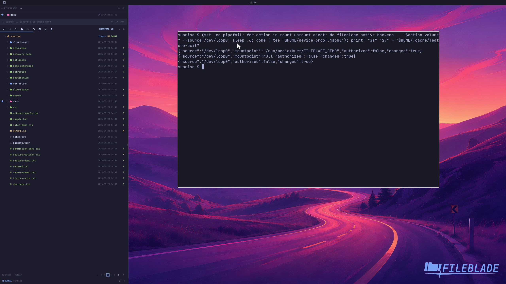

This file was written by an agent.

# Mount, unmount and eject drives

Mount, unmount, or eject an eligible device from Drives. Availability depends on the device and desktop storage services.

Demonstration: A disposable loop-backed filesystem mounts, unmounts, and ejects, with each real action reporting a change.

Only a task-owned disk image is used. No user drive is modified.

Evidence reviewed.

[Watch the focused demonstration](device-actions.mp4) (5.97 seconds; muted, original speed).

Capture source: `5ecf61b6a03ffea34fe7317483668ec3464a1764`. See the [evidence standard](../../evidence.md) and [coverage](../../catalog.json).
