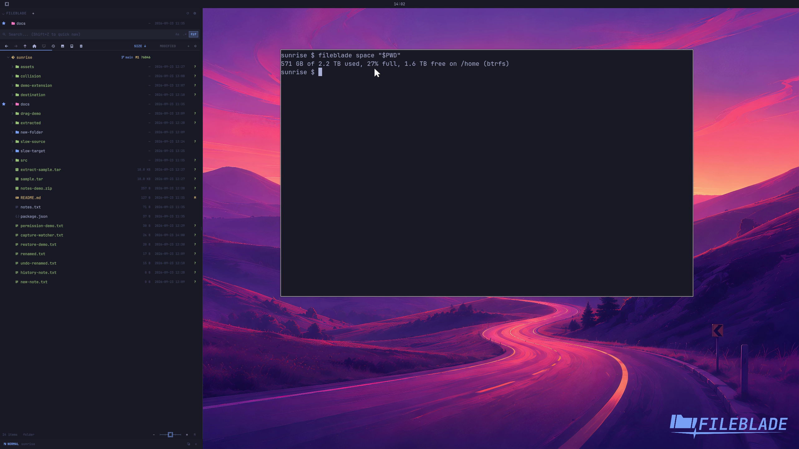

This file was written by an agent.

# See drive capacity

Enable drive usage under the toolbar in Files settings. The capacity display refers to the filesystem containing the current location.

```sh
fileblade space /path/to/project
```

Demonstration: The CLI returns capacity information for the filesystem behind the visible folder.

Evidence reviewed.



[Watch the focused demonstration](drive-space.mp4) (5.83 seconds; muted, original speed).

Capture source: `8e07a7eb93ddac81af15a9d35eaf21d6171833ae`. See the [evidence standard](../../evidence.md) and [coverage](../../catalog.json).
