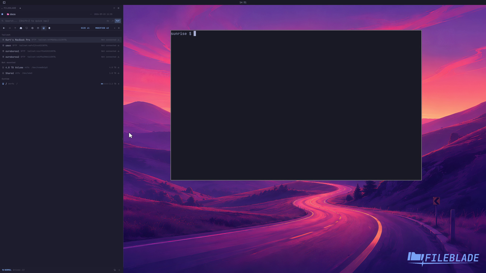

This file was written by an agent.

# Browse mounted drives

Use the Drives toolbar button to inspect available storage locations. Mounted locations can be opened in Files.

Demonstration: The Drives view opens and lists the available locations.

The clip does not mount a user device; see the separate device-actions demonstration.

Evidence reviewed.

[Watch the focused demonstration](drives.mp4) (5.5 seconds; muted, original speed).

Capture source: `3db27943d1b3a31e155febf9cf0928fb7bb6eb63`. See the [evidence standard](../../evidence.md) and [coverage](../../catalog.json).
