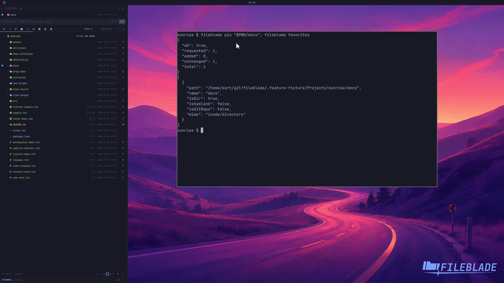

This file was written by an agent.

# Pin favorite locations

Pin a folder to keep it available in the Favorites strip. Click the favorite to navigate back to that location.

```sh
fileblade pin /path/to/project/docs
fileblade favorites
```

Demonstration: The docs folder is pinned and returned in the favorites list.

Evidence reviewed.



[Watch the focused demonstration](favorites.mp4) (5.87 seconds; muted, original speed).

Capture source: `8e07a7eb93ddac81af15a9d35eaf21d6171833ae`. See the [evidence standard](../../evidence.md) and [coverage](../../catalog.json).
