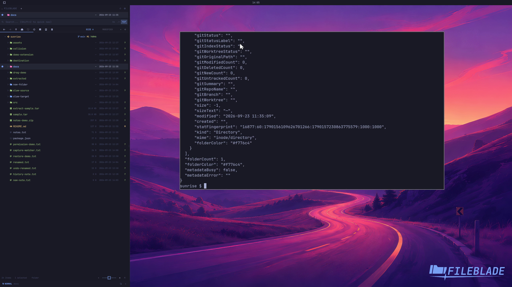

This file was written by an agent.

# Color folders

Assign a color to a folder to recognize it quickly. The theme supplies the palette; Files settings control which parts of the row receive the color.

```sh
fileblade set-folder-color /path/to/project/docs red
```

Demonstration: The docs folder receives the chosen red color.

Evidence reviewed.



[Watch the focused demonstration](folder-colors.mp4) (5.87 seconds; muted, original speed).

Capture source: `8e07a7eb93ddac81af15a9d35eaf21d6171833ae`. See the [evidence standard](../../evidence.md) and [coverage](../../catalog.json).
