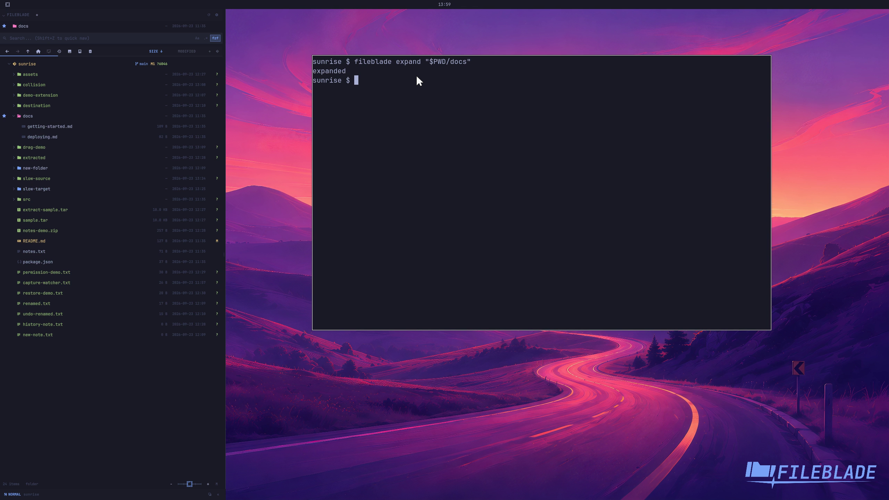

This file was written by an agent.

# Expand and collapse folders

Expand a folder to inspect children in place. The root stays fixed, so neighboring folders remain available.

```sh
fileblade expand /path/to/project/docs
```

Demonstration: Children appear beneath docs without replacing the root.

Evidence reviewed.



[Watch the focused demonstration](folding.mp4) (5.83 seconds; muted, original speed).

Capture source: `8e07a7eb93ddac81af15a9d35eaf21d6171833ae`. See the [evidence standard](../../evidence.md) and [coverage](../../catalog.json).
