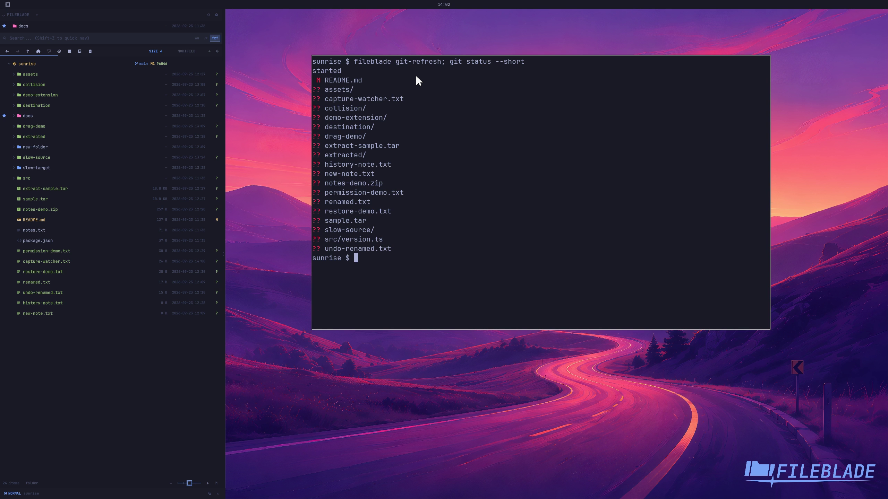

This file was written by an agent.

# See Git changes

File rows show Git changes for the current repository. Refresh the repository state after an external Git operation when needed.

```sh
fileblade git-refresh
```

Demonstration: The blade's indicators are visible beside the sample repository's actual modified and untracked files.

Evidence reviewed.



[Watch the focused demonstration](git-status.mp4) (5.83 seconds; muted, original speed).

Capture source: `8e07a7eb93ddac81af15a9d35eaf21d6171833ae`. See the [evidence standard](../../evidence.md) and [coverage](../../catalog.json).
