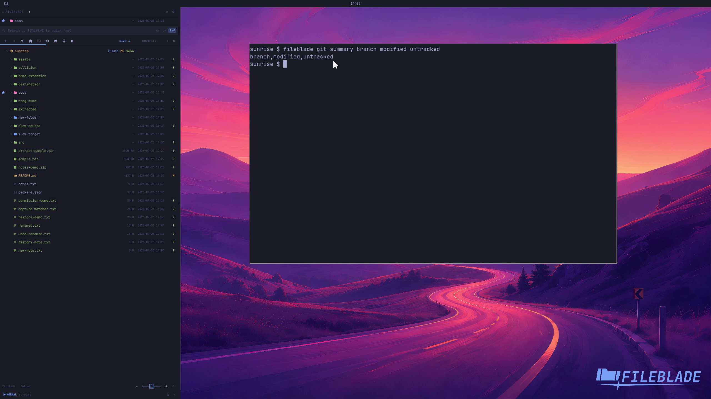

This file was written by an agent.

# Choose repository summary fields

Choose the repository summary fields you want beside the root. These summarize the current repository state.

```sh
fileblade git-summary branch modified untracked
```

Demonstration: The summary shows the branch, modified count, and untracked count.

Evidence reviewed.



[Watch the focused demonstration](git-summary.mp4) (5.87 seconds; muted, original speed).

Capture source: `8e07a7eb93ddac81af15a9d35eaf21d6171833ae`. See the [evidence standard](../../evidence.md) and [coverage](../../catalog.json).
