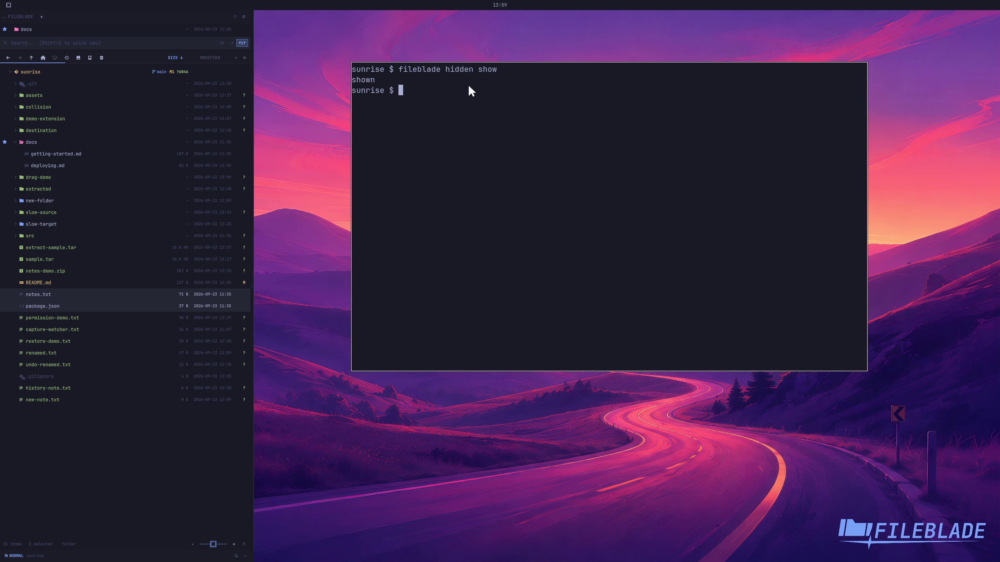

This file was written by an agent.

# Show hidden entries

Toggle hidden entries to inspect dotfiles and hidden folders. Their visibility is a view preference.

```sh
fileblade hidden show
fileblade hidden hide
```

Demonstration: Hidden entries become visible in the sample project.

Evidence reviewed.



[Watch the focused demonstration](hidden-files.mp4) (5.83 seconds; muted, original speed).

Capture source: `8e07a7eb93ddac81af15a9d35eaf21d6171833ae`. See the [evidence standard](../../evidence.md) and [coverage](../../catalog.json).
