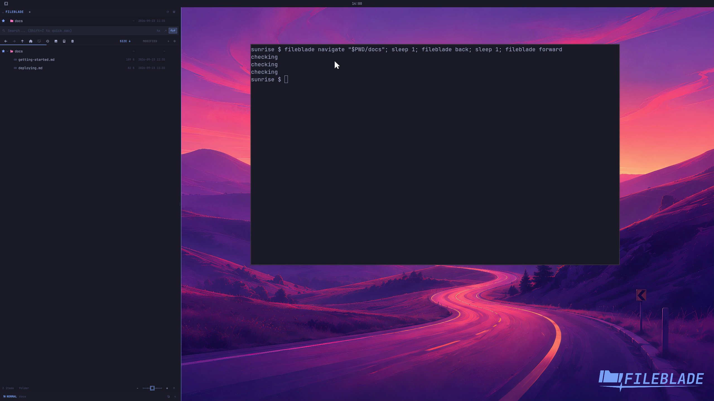

This file was written by an agent.

# Enter and revisit paths

Enter a path in the location field or navigate from the CLI. Back and Forward revisit the folder history.

```sh
fileblade navigate /path/to/project/docs
fileblade back
fileblade forward
```

Demonstration: Back returns to the previous folder and Forward returns to docs.

Evidence reviewed.



[Watch the focused demonstration](location.mp4) (5.9 seconds; muted, original speed).

Capture source: `8e07a7eb93ddac81af15a9d35eaf21d6171833ae`. See the [evidence standard](../../evidence.md) and [coverage](../../catalog.json).
