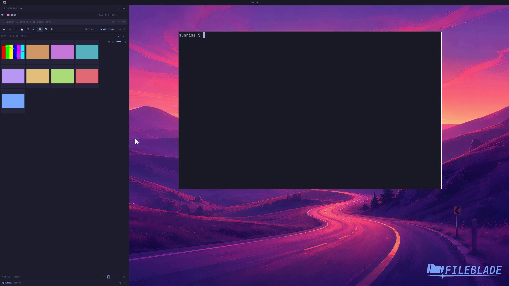

This file was written by an agent.

# Navigate the media calendar

Use the media timeline to navigate between dated groups. Populated periods reflect timestamps from the files in the current media collection.

Demonstration: The timeline changes to a broader calendar view.

The clip uses generated sample images with deliberately assigned timestamps.

Evidence reviewed.

[Watch the focused demonstration](media-calendar.mp4) (5.5 seconds; muted, original speed).

Capture source: `3db27943d1b3a31e155febf9cf0928fb7bb6eb63`. See the [evidence standard](../../evidence.md) and [coverage](../../catalog.json).
