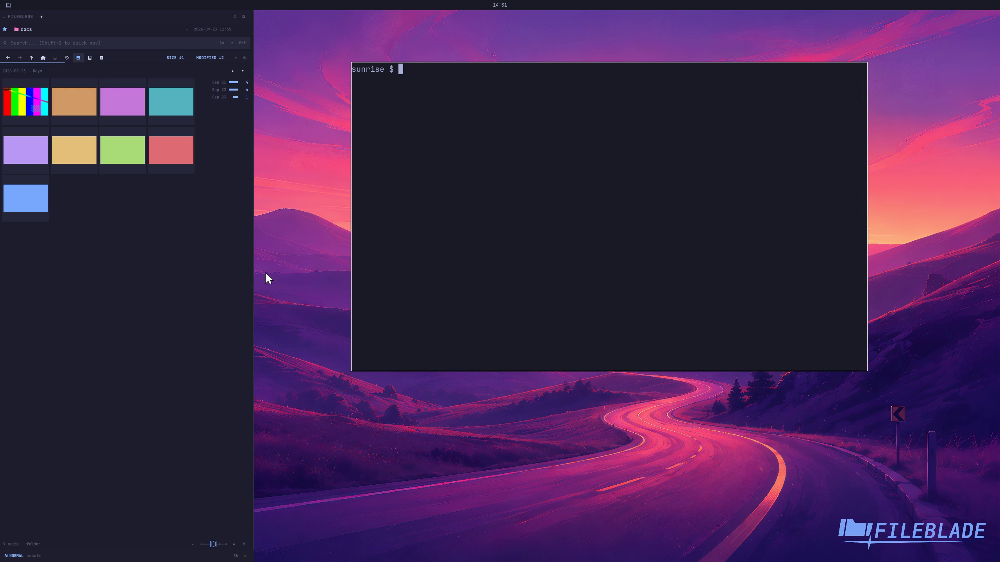

This file was written by an agent.

# Browse images and video posters

Use the Media toolbar button in a folder of images and videos. Images receive thumbnails; supported videos receive static posters.

Demonstration: The sample folder changes from a file tree to a real media grid, including a video poster.

Evidence reviewed.

[Watch the focused demonstration](media-grid.mp4) (5.5 seconds; muted, original speed).

Capture source: `3db27943d1b3a31e155febf9cf0928fb7bb6eb63`. See the [evidence standard](../../evidence.md) and [coverage](../../catalog.json).
