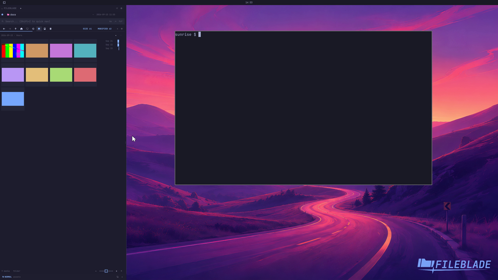

This file was written by an agent.

# Inspect hourly media activity

Drill into a day to inspect its hourly distribution. Empty hours retain their place so time remains comparable.

Demonstration: The timeline shows the selected day's hourly bars.

The sample files have assigned times; this is not a live activity feed.

Evidence reviewed.

[Watch the focused demonstration](media-hours.mp4) (5.5 seconds; muted, original speed).

Capture source: `3db27943d1b3a31e155febf9cf0928fb7bb6eb63`. See the [evidence standard](../../evidence.md) and [coverage](../../catalog.json).
