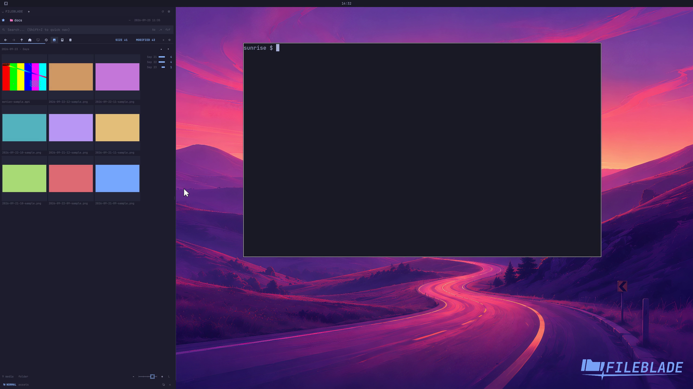

This file was written by an agent.

# Resize media thumbnails

Use the media-size control in the footer to change thumbnail dimensions. The current media folder stays open.

Demonstration: The grid grows its thumbnails after the size control is activated.

Evidence reviewed.

[Watch the focused demonstration](media-size.mp4) (5.5 seconds; muted, original speed).

Capture source: `3db27943d1b3a31e155febf9cf0928fb7bb6eb63`. See the [evidence standard](../../evidence.md) and [coverage](../../catalog.json).
