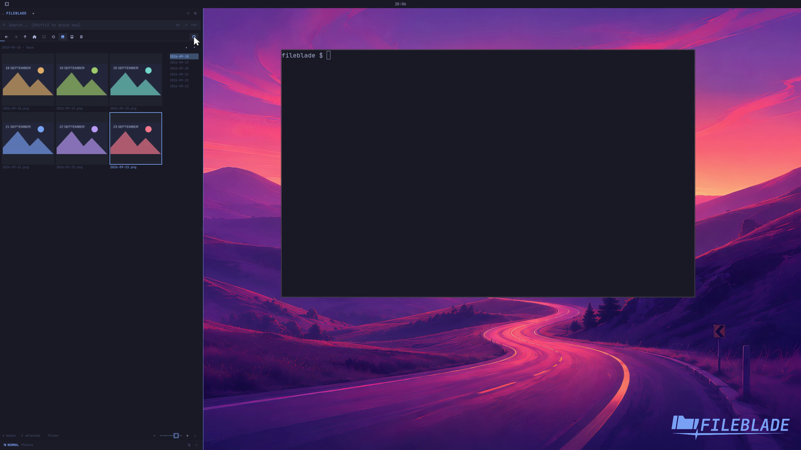

This file was written by an agent.

# Sort media newest or oldest first

Media opens newest first, using file modification time. The toolbar arrow switches between descending (newest first) and ascending (oldest first), replacing the Git and column controls while Media is active.

Click the arrow to reverse the order. With it focused, Space does the same. The grid returns to its beginning and preserves the selected file. The choice survives restarting FileBlade.

Demonstration: The real grid starts with 23 September, reverses to 18 September, then returns to newest first.

Generated image fixtures have deliberately assigned modification dates. The chosen direction is saved per Files pane; ordinary file-tree sorting stays independent.

[Watch the focused demonstration](media-sort.mp4) (6.5 seconds; muted, original speed).

Capture source: `5627c0bff1c1c8fe03e5bcd734d905f0c86723ec`. See the [evidence standard](../../evidence.md) and [coverage](../../catalog.json).
