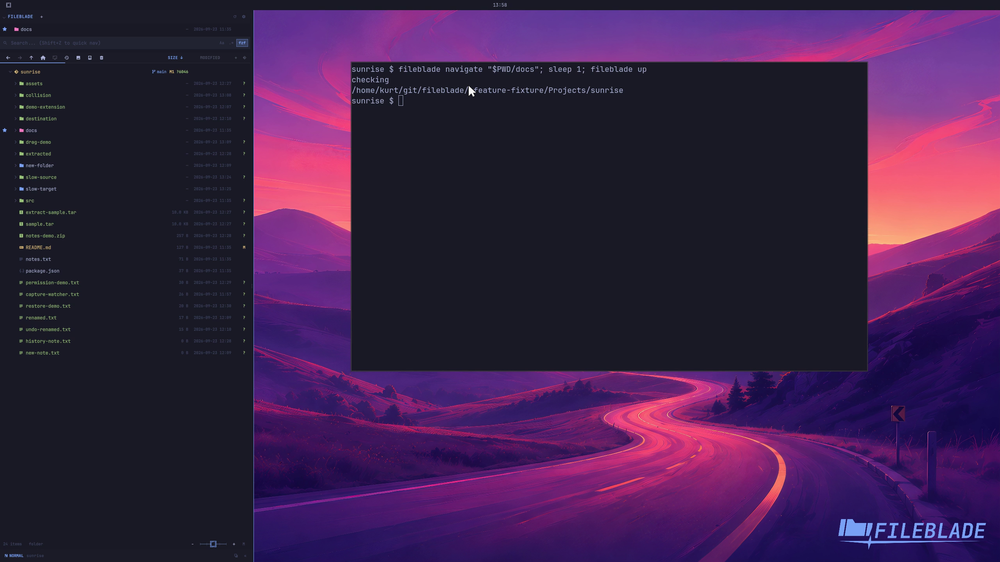

This file was written by an agent.

# Navigate the file tree

Open a folder with Enter or a double-click. Use the parent action to move up; the CLI can navigate to the same paths.

```sh
fileblade navigate /path/to/project/docs
fileblade up
```

Demonstration: The tree enters docs and returns to its parent.

Evidence reviewed.



[Watch the focused demonstration](navigation.mp4) (5.87 seconds; muted, original speed).

Capture source: `8e07a7eb93ddac81af15a9d35eaf21d6171833ae`. See the [evidence standard](../../evidence.md) and [coverage](../../catalog.json).
