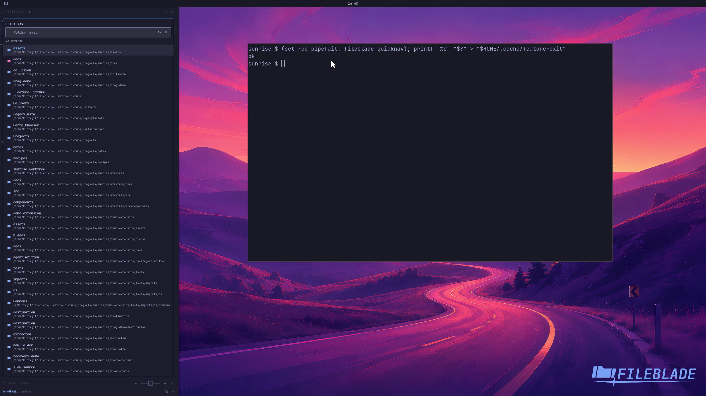

This file was written by an agent.

# Jump to recent folders

Open quick navigation to find a location from its ranked folder list. Choose a result to navigate there.

```sh
fileblade quicknav
```

Demonstration: The real quick-navigation overlay opens with available locations.

The recording covers the overlay, not a completed selection.

Evidence reviewed.



[Watch the focused demonstration](quick-navigation.mp4) (5.97 seconds; muted, original speed).

Capture source: `c3e48bbee4f8e6c5adf0e12a3b1781ed6f6af833`. See the [evidence standard](../../evidence.md) and [coverage](../../catalog.json).
