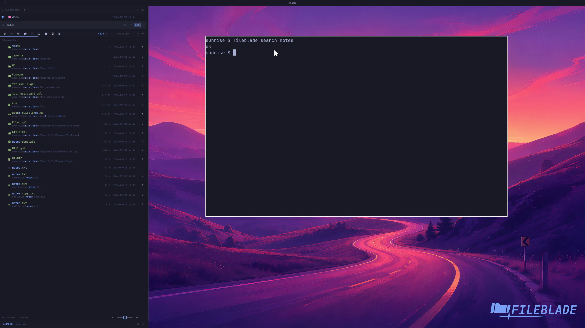

This file was written by an agent.

# Search the current folder

Enter a query in the Files search field. Clear it to return to the unfiltered tree.

```sh
fileblade search notes
fileblade clear-search
```

Demonstration: The query narrows the tree to matching file names.

Evidence reviewed.



[Watch the focused demonstration](search.mp4) (5.83 seconds; muted, original speed).

Capture source: `8e07a7eb93ddac81af15a9d35eaf21d6171833ae`. See the [evidence standard](../../evidence.md) and [coverage](../../catalog.json).
