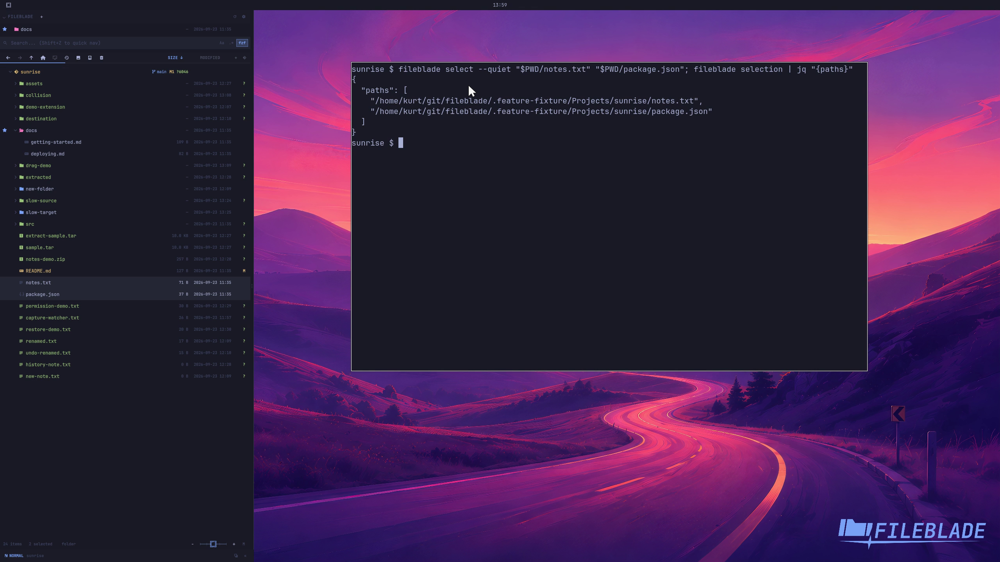

This file was written by an agent.

# Select multiple files

Use Ctrl-click to add individual rows or Shift-click for a range. The CLI can set and read the same selection.

```sh
fileblade select /path/to/notes.txt /path/to/package.json
fileblade selection
```

Demonstration: Two files become selected and the CLI returns their paths.

The recording uses CLI selection; it does not show the mouse gestures.

Evidence reviewed.



[Watch the focused demonstration](selection.mp4) (5.9 seconds; muted, original speed).

Capture source: `8e07a7eb93ddac81af15a9d35eaf21d6171833ae`. See the [evidence standard](../../evidence.md) and [coverage](../../catalog.json).
