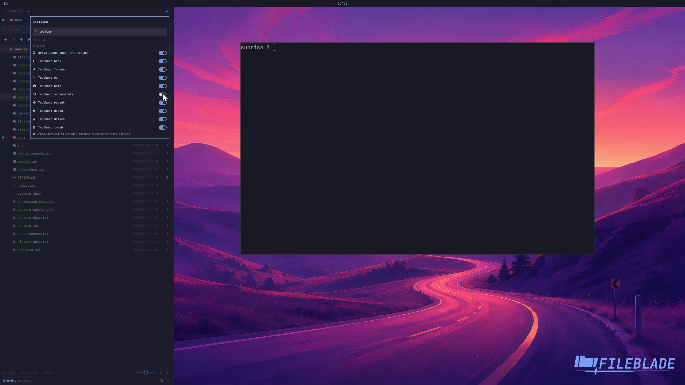

This file was written by an agent.

# Customize the tree toolbar

Open settings, search for toolbar, and toggle the controls you want to keep visible. Removing a button does not remove its underlying action.

```sh
fileblade blade settings left
```

Demonstration: The Screenshots toolbar button is hidden through the real settings form.

Evidence reviewed.



[Watch the focused demonstration](toolbar.mp4) (7.27 seconds; muted, original speed).

Capture source: `c3e48bbee4f8e6c5adf0e12a3b1781ed6f6af833`. See the [evidence standard](../../evidence.md) and [coverage](../../catalog.json).
