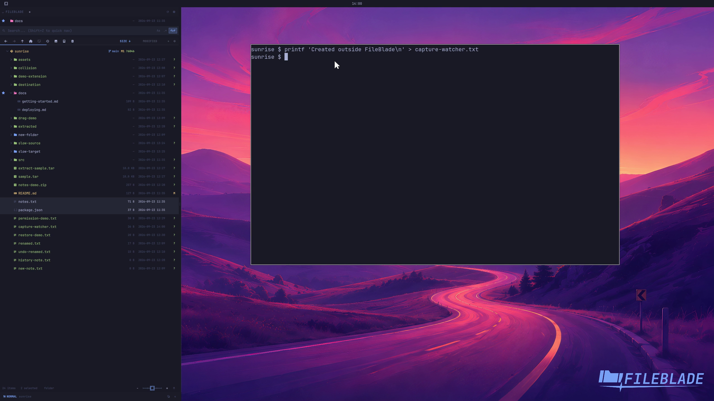

This file was written by an agent.

# Follow filesystem changes

FileBlade watches the current location for filesystem changes. Files created by an editor or terminal appear in the tree automatically.

Demonstration: Creating a sample file outside FileBlade adds its row to the open folder.

Evidence reviewed.

[Watch the focused demonstration](watching.mp4) (5.87 seconds; muted, original speed).

Capture source: `8e07a7eb93ddac81af15a9d35eaf21d6171833ae`. See the [evidence standard](../../evidence.md) and [coverage](../../catalog.json).
