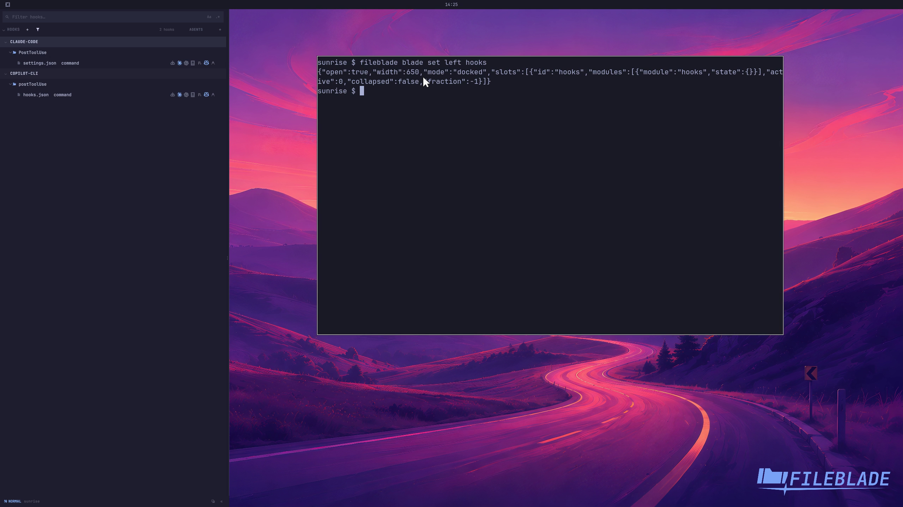

This file was written by an agent.

# Inspect agent hooks

Hooks shows configured hook events and their commands. Reading this inventory does not execute those commands.

```sh
fileblade blade set left hooks
```

Demonstration: The pane displays the sample PostToolUse hook and its configuration.

Evidence reviewed.



[Watch the focused demonstration](inventory.mp4) (5.83 seconds; muted, original speed).

Capture source: `3db27943d1b3a31e155febf9cf0928fb7bb6eb63`. See the [evidence standard](../../evidence.md) and [coverage](../../catalog.json).
