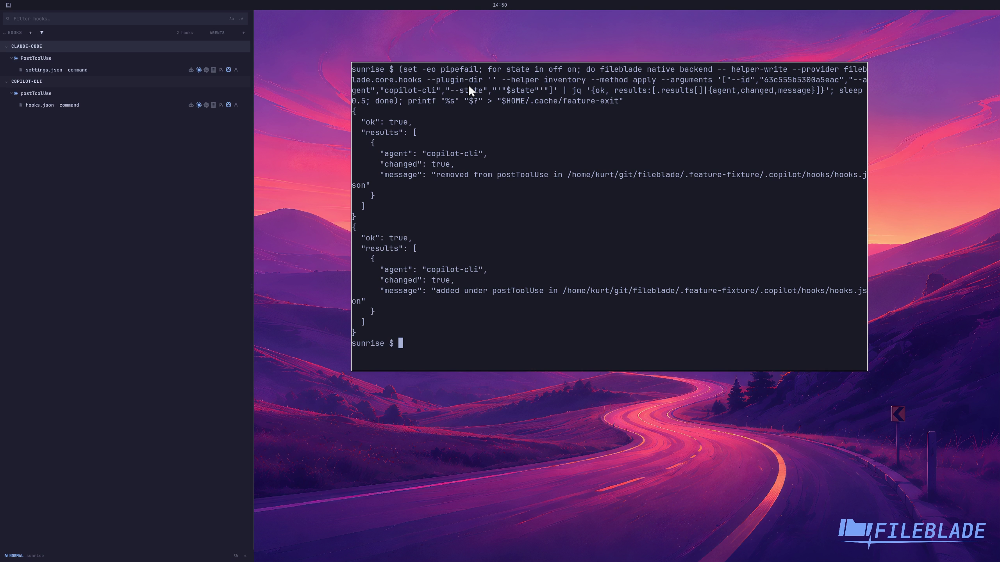

This file was written by an agent.

# Manage shared hooks

With agent management enabled, share a compatible hook with another supported agent or remove its managed copy.

Demonstration: The sample hook's managed Copilot CLI configuration is removed and restored.

The source hook is retained; the sample command is not executed.

Evidence reviewed.

[Watch the focused demonstration](management.mp4) (5.97 seconds; muted, original speed).

Capture source: `c3e48bbee4f8e6c5adf0e12a3b1781ed6f6af833`. See the [evidence standard](../../evidence.md) and [coverage](../../catalog.json).
