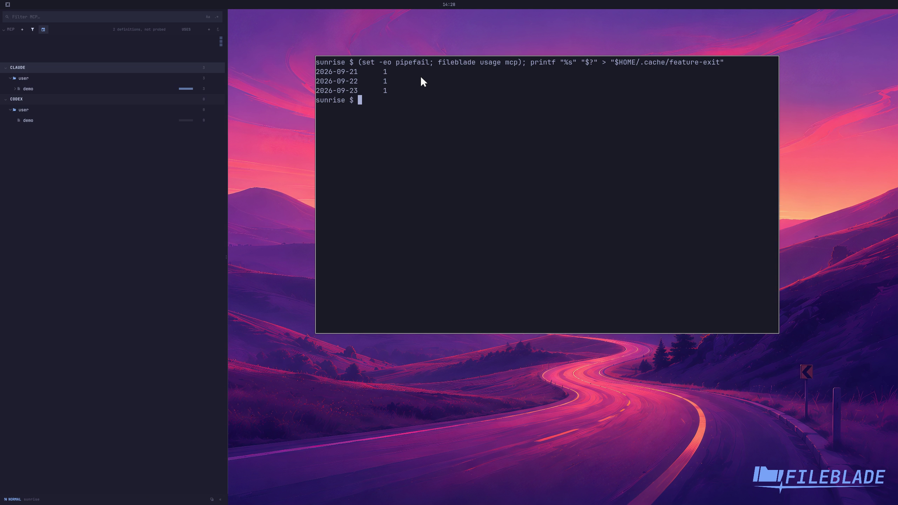

This file was written by an agent.

# Inspect MCP calls

Inspect MCP usage collected from supported local transcripts. Tool, resource, and prompt activity depends on what the agent recorded.

```sh
fileblade usage mcp
```

Demonstration: The CLI reports the sample server's imported call counts.

These are synthetic transcript events, not a connection to a live MCP server.

Evidence reviewed.



[Watch the focused demonstration](activity.mp4) (5.97 seconds; muted, original speed).

Capture source: `3db27943d1b3a31e155febf9cf0928fb7bb6eb63`. See the [evidence standard](../../evidence.md) and [coverage](../../catalog.json).
