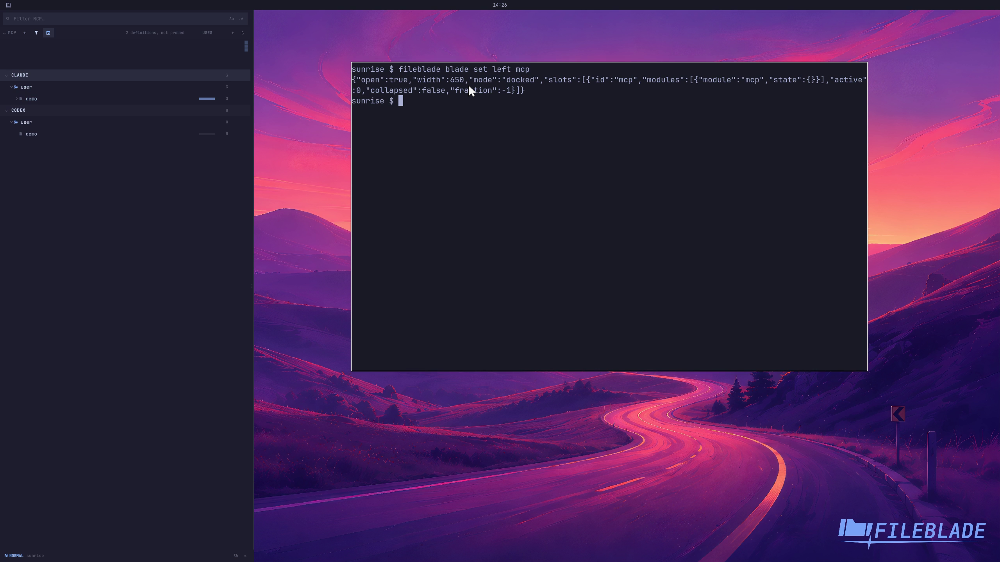

This file was written by an agent.

# Inspect MCP servers

MCP lists server definitions discovered in supported agents' configuration. Inspecting a definition does not start the server.

```sh
fileblade blade set left mcp
```

Demonstration: The pane shows the sample server and its configured agent.

Evidence reviewed.



[Watch the focused demonstration](inventory.mp4) (5.83 seconds; muted, original speed).

Capture source: `3db27943d1b3a31e155febf9cf0928fb7bb6eb63`. See the [evidence standard](../../evidence.md) and [coverage](../../catalog.json).
