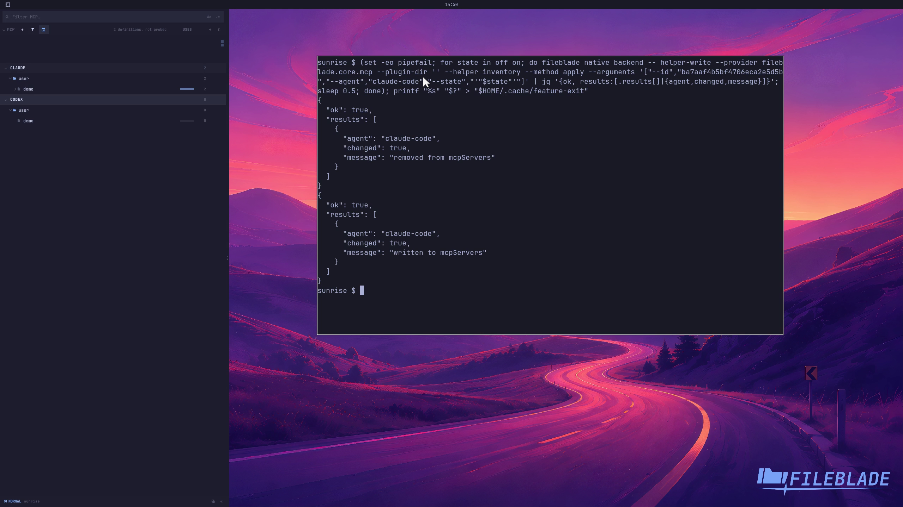

This file was written by an agent.

# Manage shared MCP definitions

Agent management can add or remove a compatible server definition for another supported agent.

Demonstration: The sample server's Claude Code configuration is removed and restored.

The source definition is preserved and the sample server is not launched.

Evidence reviewed.

[Watch the focused demonstration](management.mp4) (5.97 seconds; muted, original speed).

Capture source: `c3e48bbee4f8e6c5adf0e12a3b1781ed6f6af833`. See the [evidence standard](../../evidence.md) and [coverage](../../catalog.json).
