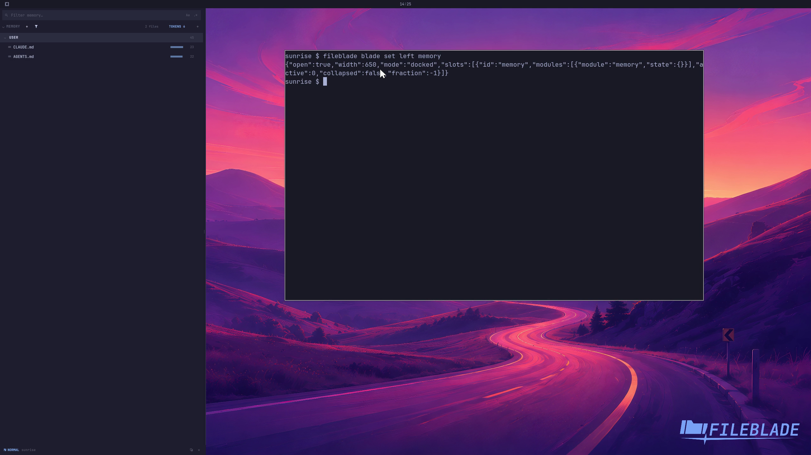

This file was written by an agent.

# Browse agent instructions

Memory discovers supported agents' instruction files. The pane identifies the source so you can inspect the instructions that apply.

```sh
fileblade blade set left memory
```

Demonstration: The pane displays the sample profile's actual instruction files and their agents.

Evidence reviewed.



[Watch the focused demonstration](inventory.mp4) (5.83 seconds; muted, original speed).

Capture source: `3db27943d1b3a31e155febf9cf0928fb7bb6eb63`. See the [evidence standard](../../evidence.md) and [coverage](../../catalog.json).
