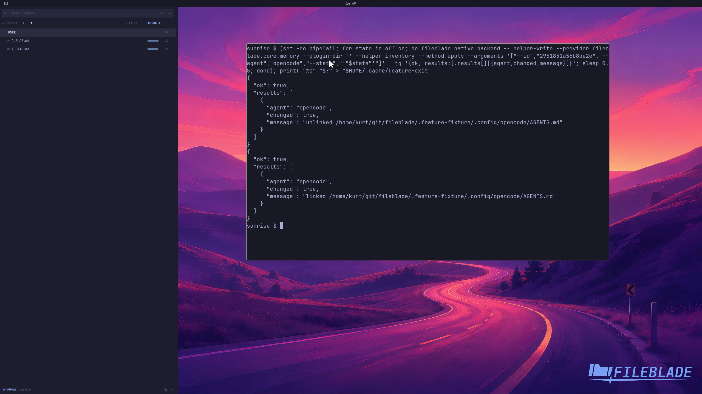

This file was written by an agent.

# Share instruction files

Agent management can share supported instruction files with another agent. Managed links can be removed and restored without deleting their original source.

```sh
fileblade preferences --agent-management true
```

Demonstration: The sample instruction's OpenCode link is removed and restored.

The recording uses the real management provider against disposable files.

Evidence reviewed.



[Watch the focused demonstration](management.mp4) (5.97 seconds; muted, original speed).

Capture source: `c3e48bbee4f8e6c5adf0e12a3b1781ed6f6af833`. See the [evidence standard](../../evidence.md) and [coverage](../../catalog.json).
