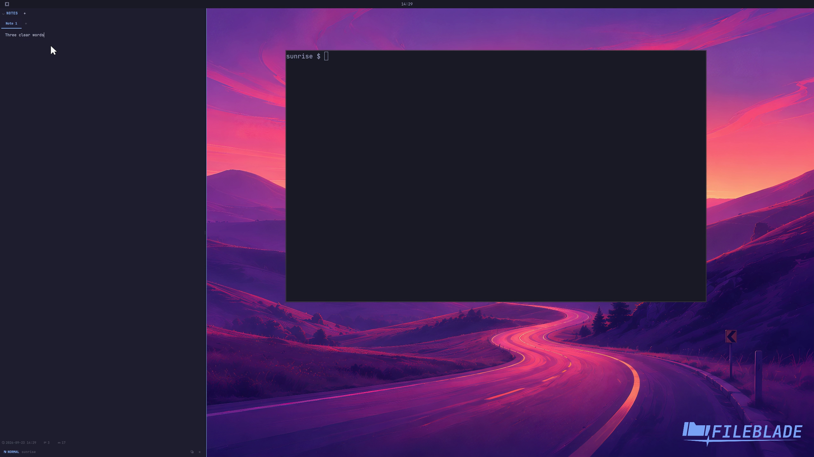

This file was written by an agent.

# Read note counts

The Notes footer reports the current note's word and character counts. Counts update as you edit.

Demonstration: Editing the sample note changes the displayed counts.

Evidence reviewed.

[Watch the focused demonstration](counts.mp4) (5.47 seconds; muted, original speed).

Capture source: `3db27943d1b3a31e155febf9cf0928fb7bb6eb63`. See the [evidence standard](../../evidence.md) and [coverage](../../catalog.json).
