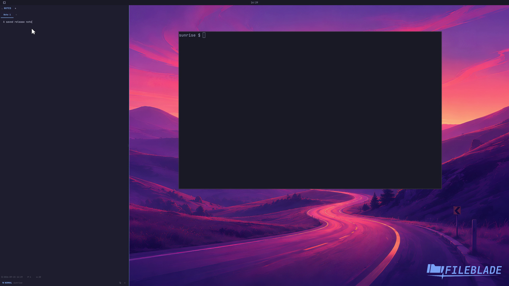

This file was written by an agent.

# Write persistent notes

Open Notes and type directly into its editor. Notes saves changes automatically in the pane state.

```sh
fileblade blade set left notes
```

Demonstration: The note text changes to A saved release note and the saved state contains that text.

This clip proves editing and autosave; native-view persistence has a separate recording.

Evidence reviewed.



[Watch the focused demonstration](editing.mp4) (5.57 seconds; muted, original speed).

Capture source: `3db27943d1b3a31e155febf9cf0928fb7bb6eb63`. See the [evidence standard](../../evidence.md) and [coverage](../../catalog.json).
