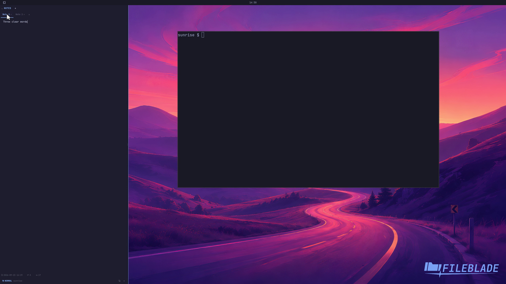

This file was written by an agent.

# Manage note tabs

Use note tabs to keep separate texts in one Notes pane. Select a tab to restore its note.

Demonstration: The recording switches between notes while each retains its text.

It does not demonstrate every create, rename, and close action.

Evidence reviewed.

[Watch the focused demonstration](notebooks.mp4) (5.8 seconds; muted, original speed).

Capture source: `3db27943d1b3a31e155febf9cf0928fb7bb6eb63`. See the [evidence standard](../../evidence.md) and [coverage](../../catalog.json).
