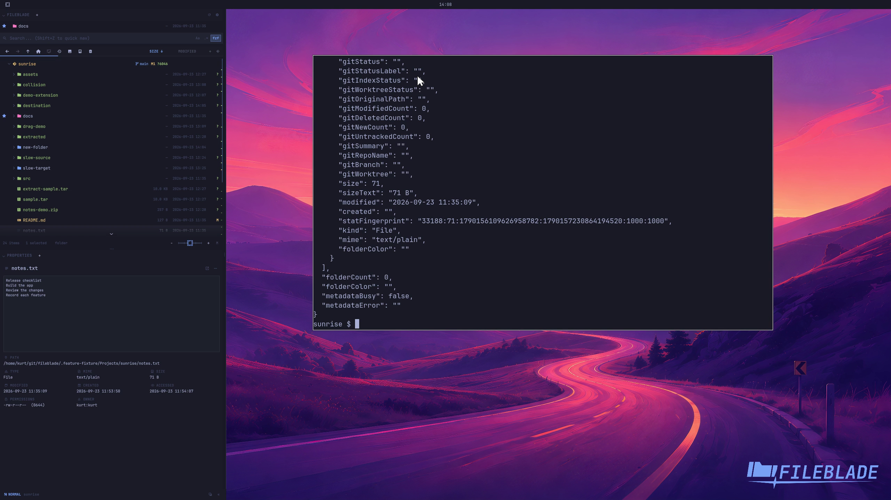

This file was written by an agent.

# Inspect file properties

Add Properties beside Files, then select an entry. Properties follows the selected path and shows its metadata.

```sh
fileblade select /path/to/notes.txt
```

Demonstration: Properties shows the selected sample file's actual path, type, and size.

Evidence reviewed.



[Watch the focused demonstration](metadata.mp4) (5.83 seconds; muted, original speed).

Capture source: `8e07a7eb93ddac81af15a9d35eaf21d6171833ae`. See the [evidence standard](../../evidence.md) and [coverage](../../catalog.json).
