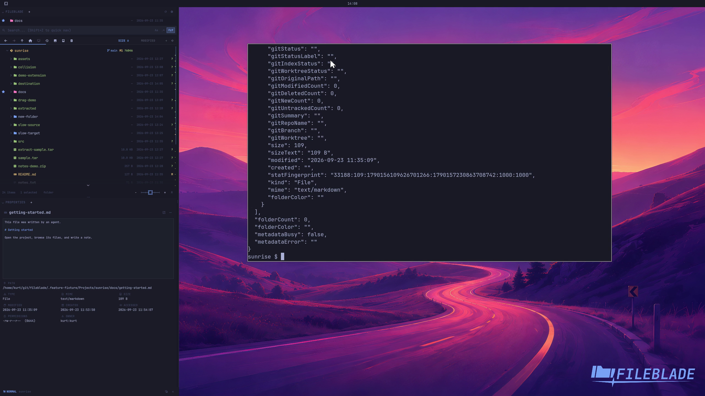

This file was written by an agent.

# Preview text

Select a supported text file while Properties is open. The preview displays bounded file content without opening an editor.

```sh
fileblade select /path/to/getting-started.md
```

Demonstration: Properties displays the actual sample document text.

Evidence reviewed.



[Watch the focused demonstration](text-preview.mp4) (5.87 seconds; muted, original speed).

Capture source: `8e07a7eb93ddac81af15a9d35eaf21d6171833ae`. See the [evidence standard](../../evidence.md) and [coverage](../../catalog.json).
