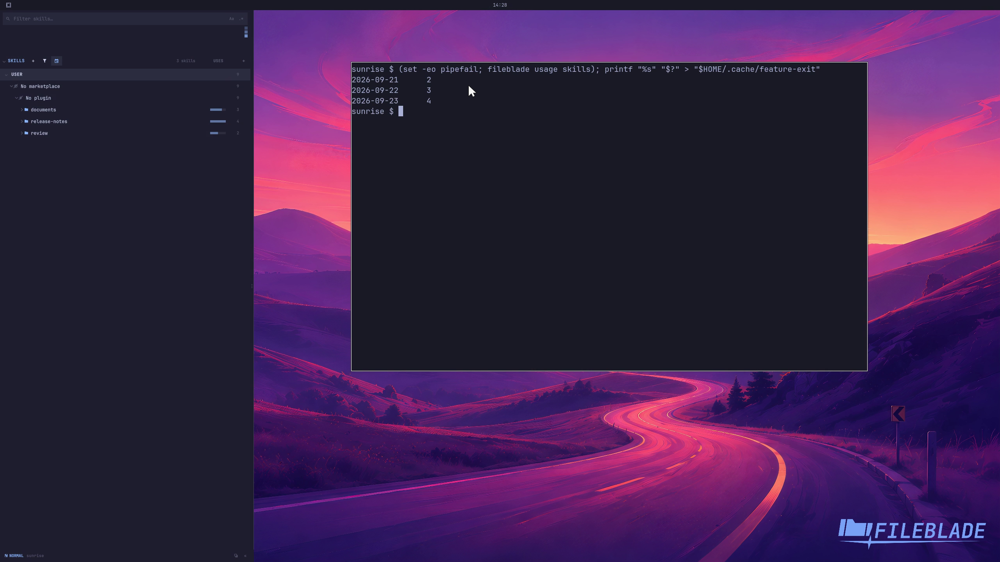

This file was written by an agent.

# Inspect skill activity

Skills summarizes usage recorded in supported agents' local transcripts. Inspect a day or entry to see its recorded activity.

```sh
fileblade usage skills
```

Demonstration: The pane and CLI show usage imported from the sample transcripts.

The activity data is synthetic fixture data; no live agent execution is claimed.

Evidence reviewed.



[Watch the focused demonstration](activity.mp4) (5.97 seconds; muted, original speed).

Capture source: `3db27943d1b3a31e155febf9cf0928fb7bb6eb63`. See the [evidence standard](../../evidence.md) and [coverage](../../catalog.json).
