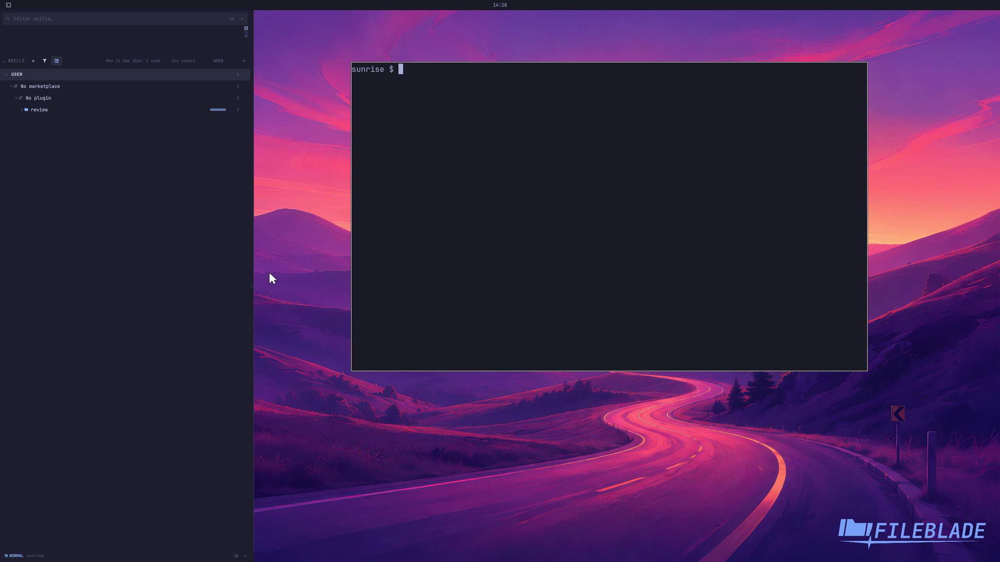

This file was written by an agent.

# Filter skills by day

Select a populated day in the Skills activity grid to narrow the inventory to skills used on that day.

Demonstration: Selecting a sample activity day changes the visible skill inventory.

The timestamps and usage events come from synthetic local transcripts.

Evidence reviewed.

[Watch the focused demonstration](day-filter.mp4) (5.5 seconds; muted, original speed).

Capture source: `3db27943d1b3a31e155febf9cf0928fb7bb6eb63`. See the [evidence standard](../../evidence.md) and [coverage](../../catalog.json).
