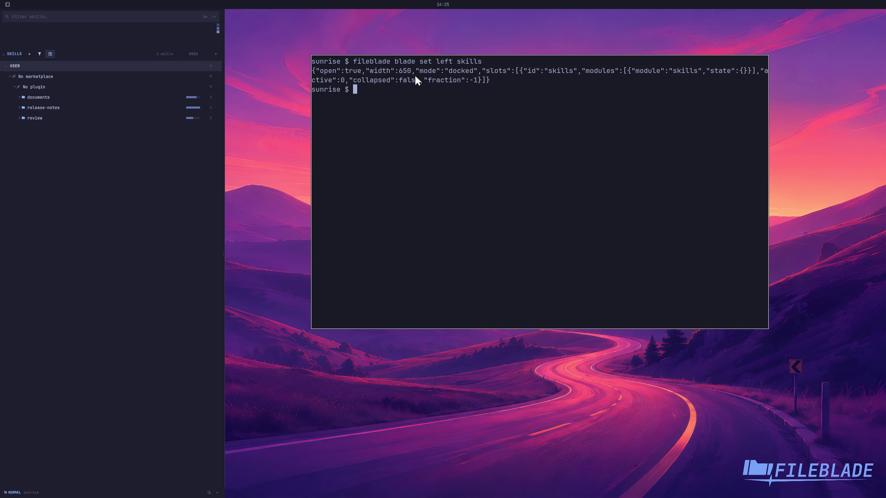

This file was written by an agent.

# Browse agent skills

Skills discovers supported agents' skill files and shows their sources. Open an entry to inspect its files without invoking the skill.

```sh
fileblade blade set left skills
```

Demonstration: The pane lists the disposable profile's discovered skills and agent ownership.

Evidence reviewed.



[Watch the focused demonstration](inventory.mp4) (5.83 seconds; muted, original speed).

Capture source: `3db27943d1b3a31e155febf9cf0928fb7bb6eb63`. See the [evidence standard](../../evidence.md) and [coverage](../../catalog.json).
