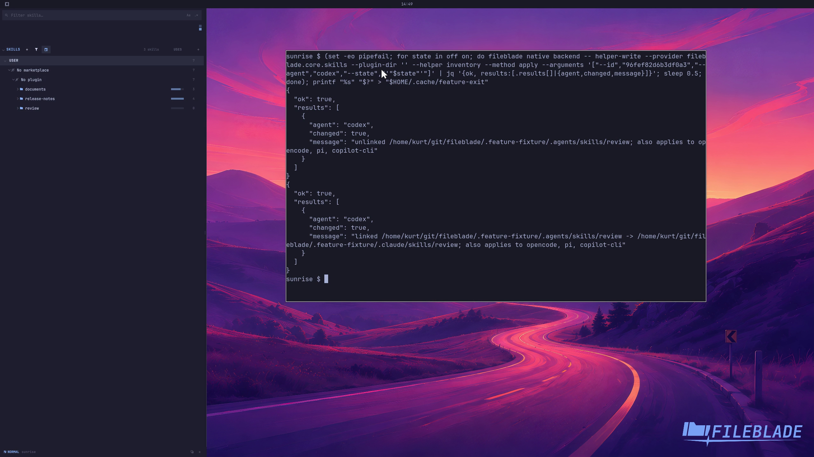

This file was written by an agent.

# Share and unshare skills

Enable agent management in preferences to manage which supported agents receive a skill. Unsharing an owned link leaves the original skill source intact.

```sh
fileblade preferences --agent-management true
```

Demonstration: The backend removes and restores the sample skill's Codex link while retaining the Claude source.

This clip proves provider-level sharing changes; it does not disable the original source skill.

Evidence reviewed.



[Watch the focused demonstration](management.mp4) (5.97 seconds; muted, original speed).

Capture source: `c3e48bbee4f8e6c5adf0e12a3b1781ed6f6af833`. See the [evidence standard](../../evidence.md) and [coverage](../../catalog.json).
