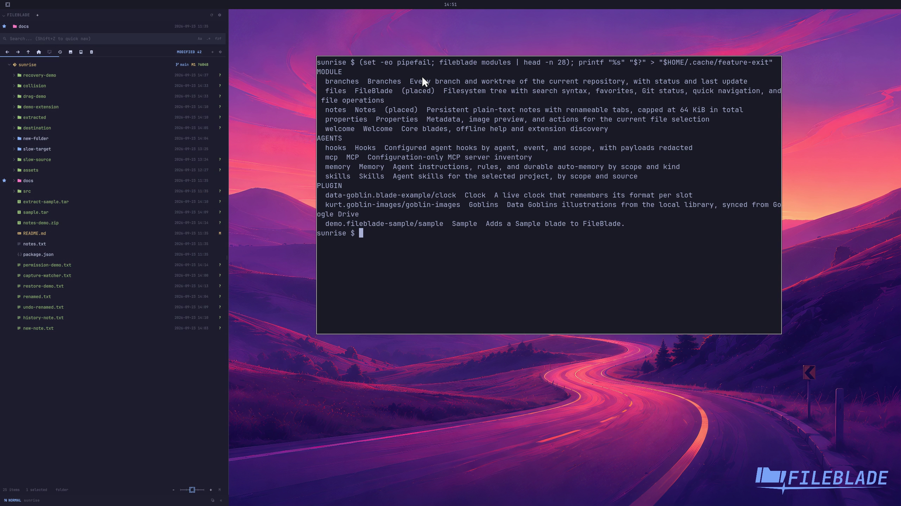

This file was written by an agent.

# Choose built-in panes

The built-in pane catalogue includes Files, Notes, Properties, Branches, Skills, Memory, Hooks, MCP, and Welcome. These do not require separate companion downloads.

```sh
fileblade modules
```

Demonstration: The CLI lists the available pane registrations beside Welcome.

The clip lists the catalogue; it does not activate every pane.

Evidence reviewed.



[Watch the focused demonstration](catalogue.mp4) (5.97 seconds; muted, original speed).

Capture source: `c3e48bbee4f8e6c5adf0e12a3b1781ed6f6af833`. See the [evidence standard](../../evidence.md) and [coverage](../../catalog.json).
