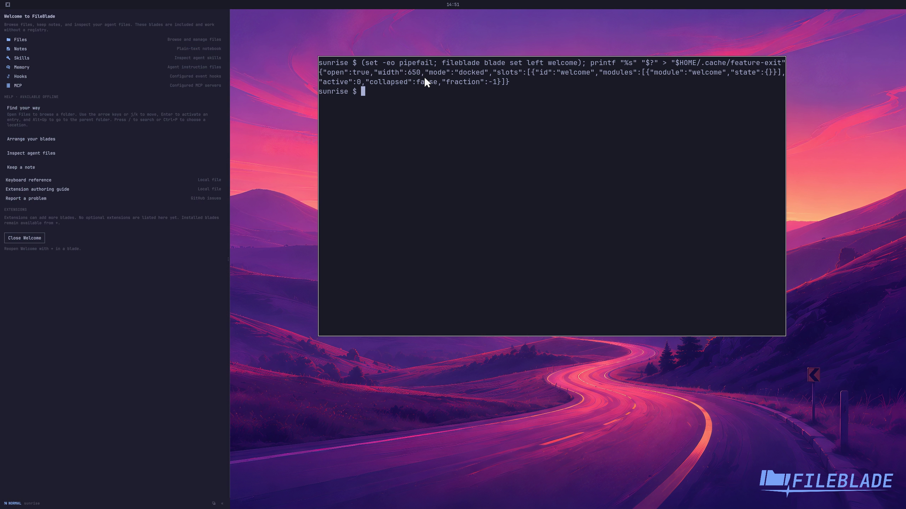

This file was written by an agent.

# Start with the Welcome pane

Welcome introduces the built-in panes and basic sidebar controls. Reopen it from the pane chooser whenever you need the reference.

```sh
fileblade blade set left welcome
```

Demonstration: The bundled Welcome pane opens with its navigation and pane choices.

Evidence reviewed.



[Watch the focused demonstration](onboarding.mp4) (5.97 seconds; muted, original speed).

Capture source: `c3e48bbee4f8e6c5adf0e12a3b1781ed6f6af833`. See the [evidence standard](../../evidence.md) and [coverage](../../catalog.json).
