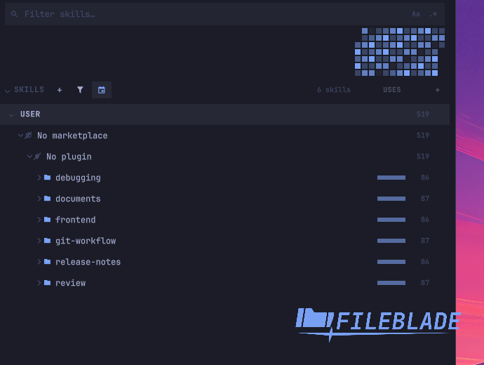
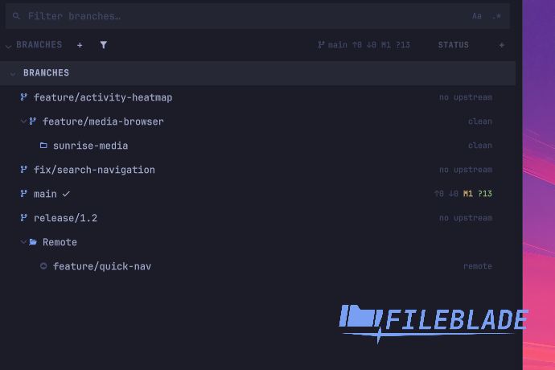
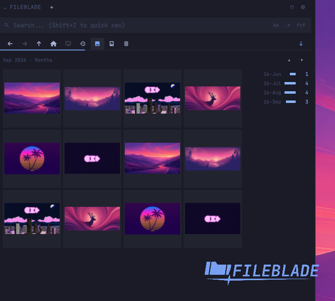
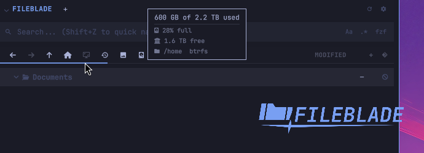

This file was written by an agent.

# FileBlade release notes

## 0.3.0 (unreleased)

## 0.2.0

**Prepared; not published.** The installation URLs below become available after publication.

FileBlade 0.2.0 is a native Omarchy application providing customizable IDE-like sidebars, file workflows, Notes, Skills, Memory, Hooks and MCP panes.

This release adds verified native installation, explicit desktop integration roles, migration, safe shutdown and rollback. It includes newest-first media browsing with a saved order toggle, working video posters, collision handling, desktop Reveal and file chooser integration, and corrected tailnet SFTP refresh.

The <= 0.1.3 plugin is archived; the project didn't work as well with the whole "plugin-in-plugin" system.

**New features:**

- Skills, mcp, hooks, memory are all part of FileBlade core
- SQLite db for tracking skill and MCP usage, and heatmap to show usage

  

- New module "Branches" that shows your git branches (local and remote) and worktrees

  

- Improvements for search and git status indicators
- Support for Tailnet and mounted / unmounted drives
- Quick access to common trash
- Media mode to see image previews

  

- Dataviz of images
- Improvements to selection wheel
- Visualization of drive storage

  

- Additional customization

Screenshots use sample data in an isolated workspace 9 session and are cropped
to the feature shown.

### Further improvements and fixes

- Media starts newest first, with a saved ascending/descending arrow replacing
  the Git and column controls. MP4 posters work with trailing metadata, and
  hourly timelines retain every day with 24 bars.
- Pickers keep text files visible after media browsing. Reveal preserves the
  requested selection while its folder loads. Copy collisions show the decision
  dialog, including Keep both.
- Terminal actions preserve tmux named and explicit sockets. Herdr targets its
  focused pane, Hunk requires Git changes, and opening a file in a new terminal
  starts Neovim. Holding Space before leaving a blade opens the drop wheel.
- Tailnet SFTP refresh retains connections made through validated SSH aliases.
  Drives remains the main volume list; “Volumes in the tree” restores the
  optional tree entries and their route to connected peers.
- Branches opens beside Properties. A linked worktree nests under its branch;
  Enter opens that folder. The main checkout is not repeated as a worktree.
  Status uses the same upstream/change counts as the file-tree summary. Branch
  switching supports remote branches, and the CLI exposes open, close and list.
- Skills and MCP activity updates when transcripts change, with a 60-second
  fallback refresh. Counts survive deleted transcripts in the private SQLite
  history; `fileblade usage skills|mcp` reads it and `fileblade usage forget`
  removes it. The former JSON cache is retired.
- Skill counts cover Claude Code, Codex, OpenCode, Copilot CLI, Antigravity and
  Pi, including namespaced skills and typed commands. MCP counts include
  Codex, OpenCode and Copilot CLI; dotted server names, resources and prompts
  are counted. Expanding an MCP row shows used tools, resources and prompts,
  including failure counts.
- Heatmap tooltips show the date, total and agent/user/scheduled shares. Click
  or press Enter on a Skills day to filter; Esc clears. Activity refresh does
  not rescan skill directories, and the Activity button hides the heatmap.
- Skills, Memory, Hooks and MCP run in the bundled Rust backend without Python
  helpers. Delete works on their rows, with separate deactivate and symlink
  actions. Disabled skills remain visible and usable through their recovery
  copy; failed bin reads preserve rows and retry.
- Hook edits refuse invalid output or loss of unrelated top-level keys, leaving
  the original file unchanged. Notes shows last edit time and word/character
  counts while retaining save-error and conflict notices.
- Search fields consistently precede pane headers, and `/` still opens search.
  Toolbar buttons are configurable, hidden buttons retain keyboard routes
  except Drives, and row density uses five stops from XS to XL.
- Native theme colors reload in both directions. Blade resizing no longer
  triggers cursor warps or jumps to maximum width. Drive usage can be hidden
  per Files tab; `fileblade space [PATH]` reports the same capacity.
- Unknown actions and malformed bindings are skipped with a notice. Older
  versions preserve newer settings/keybinding version markers, and reads
  identify the version that wrote each file.
- Native installation rejects mixed payload versions, checks the advertised
  archive version and target, and supports safe shutdown, migration, updates
  and rollback. Long state paths and launcher paths with reserved characters
  are supported. Desktop roles restore owned entries while preserving newer
  user choices; shipped bindings use the public CLI.
- Native CLI helpers share the running authority for reads and mutations.
  `fileblade doctor` reports blocked recovery as unhealthy, and refused module,
  slot, tab and screen commands exit unsuccessfully.
- Extensions can reuse the image grid, thumbnail cache, timeline and five-step
  image-size control. Module icons appear consistently in the picker, settings
  and pane header.
- Every documented feature has screenshot and short-video evidence under
  `features/`.

### Installation and verification

Install the native app on an up-to-date x86-64 Omarchy system:

```bash
curl -fsSL https://raw.githubusercontent.com/data-goblin/fileblade/v0.2.0/install.sh | sh
fileblade
```

Desktop integration is **experimental** and opt-in. For shortcuts and login startup:

```bash
fileblade native roles enable --role bindings
fileblade native roles enable --role autostart
```

Alternatively, download `fileblade-native-0.2.0-1-x86_64.pkg.tar.zst` and install it with `sudo pacman -U`.

To verify the downloads, download every attached asset into one directory and run:

```bash
sha256sum --check --strict SHA256SUMS
```

The bootstrap separately verifies the archive SHA-256, advertised version/target and complete payload inventory before installation. SHA-256 verifies integrity; these manifests are not signed.


[111 feature guides with screenshot/video proof](../index.md) · [Build provenance](../../docs/agent-written/build-provenance.md)

## 0.1.3

- UI changes
  - Hide internal caches and reset Quick Nav selection for new queries.
  - Font size: scale the text in every blade from the General settings.
- Update notification
  - Name the available release version instead of counting commits.
  - List companion updates separately, one bullet per extension.

## 0.1.2

- Add a pinned workflow with signed backend build provenance.

## 0.1.1

- Bound extension operations and require explicit consent before cleanup.
- Ask once whether FileBlade may empty the trash automatically.

## 0.1.0

- Install the Welcome extensions at reviewed commits and refuse installation if a pin is unavailable.
- Keep recent trash-test fixtures relative to the test run so retention checks do not fail as dates pass.
- Synchronize trash confirmations across monitors and bind answers to their requests.
- Super+B and Super+Shift+B close open blades with one press.
- Choose Active, mirrored All, or a named monitor lock in Settings.
- Clamp blade widths to each monitor without changing saved preferences.
- Cancel close-tab confirmations when their slot or tabs change.
- Keep delayed navigation focus on its original monitor.
- Cancel pending trash requests when their confirming pane hides or unloads.
- Cancel menus, wheels, drags, and focus when their monitor disconnects.
- Resolve hover, drops, and explicit window focus across visible monitors.
- Keep directional focus routing on each blade's assigned monitor.
- Open undocked blades on their monitor, preserving ordinary window movement.
- Recognize Foot server windows as terminal targets.
- Prevent terminal actions from reaching another shared window.
