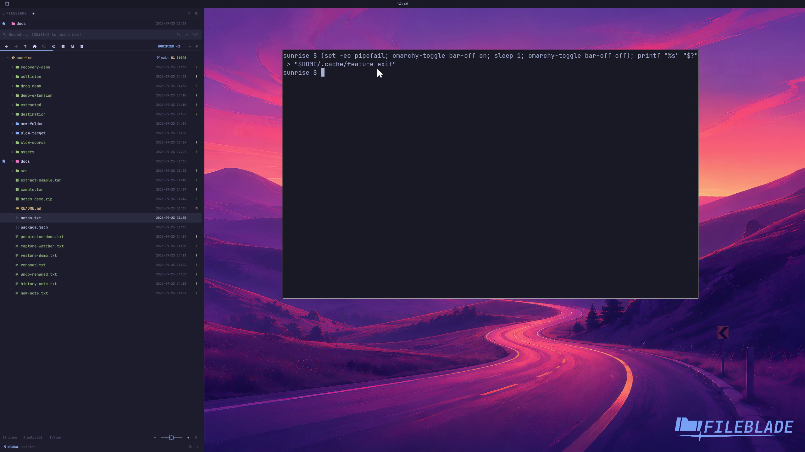

This file was written by an agent.

# Follow desktop bar placement

Docked blades account for the Omarchy bar. Showing or hiding the bar updates the space available to the blade.

Demonstration: The capture profile hides its bar and then restores it.

Evidence reviewed.

[Watch the focused demonstration](bar.mp4) (5.97 seconds; muted, original speed).

Capture source: `c3e48bbee4f8e6c5adf0e12a3b1781ed6f6af833`. See the [evidence standard](../evidence.md) and [coverage](../catalog.json).
