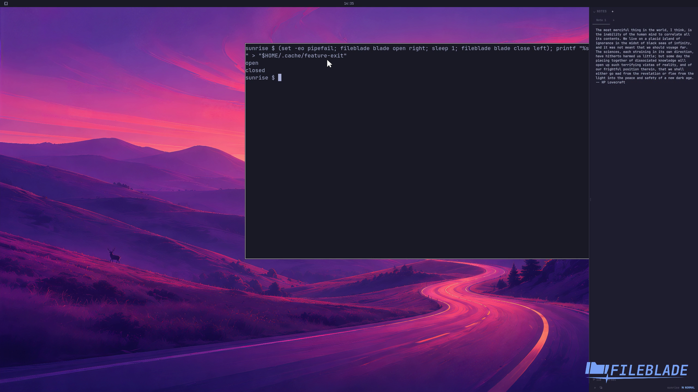

This file was written by an agent.

# Open and close sidebars

Open either edge independently. The Files pane keeps its folder when its blade closes; reopening restores the pane.

```sh
fileblade blade open left
fileblade blade open right
fileblade blade close left
```

Demonstration: The right blade opens, then the left blade closes.

Evidence reviewed.



[Watch the focused demonstration](blades.mp4) (5.97 seconds; muted, original speed).

Capture source: `3db27943d1b3a31e155febf9cf0928fb7bb6eb63`. See the [evidence standard](../evidence.md) and [coverage](../catalog.json).
