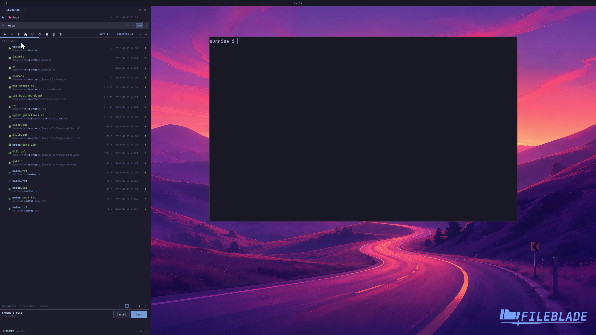

This file was written by an agent.

# Customize tree keybindings

Customize action bindings in FileBlade's keybindings document, then reload it. Binding names describe actions such as search.

```sh
fileblade native ipc -- data-goblin.fileblade.control reloadKeybindings
```

Demonstration: A temporary F6 binding focuses search and enters a query.

The demonstration changes only the capture profile's keymap.

Evidence reviewed.



[Watch the focused demonstration](custom-keys.mp4) (5.5 seconds; muted, original speed).

Capture source: `3db27943d1b3a31e155febf9cf0928fb7bb6eb63`. See the [evidence standard](../evidence.md) and [coverage](../catalog.json).
